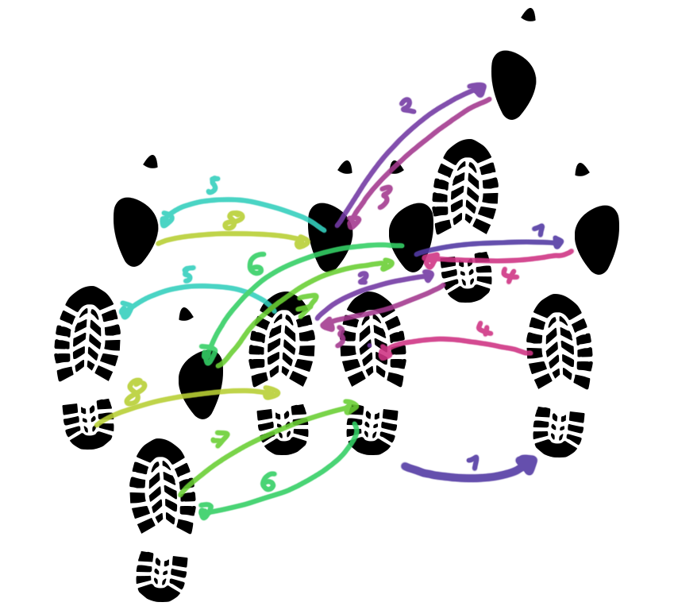

# Grundschritt

## Basisbewegung

Beginne mit geschlossener Haltung, wobei der Mann die rechte Hand auf der Schulterblattregion der Frau platziert und die linke Hand der Frau in der rechten Hand des Mannes liegt.
Der Grundschritt besteht aus Wiegeschritten nach vorne und hinten, sowie einem seitlichen "Cha-Cha-Cha" Teil.

## Wiegeschritte für den Mann

- Nach vorne: Setze den linken Fuß leicht nach vorne, während du dein Gewicht auf den linken Fuß verlagerst.
- Nach hinten: Setze den rechten Fuß leicht nach hinten, während du dein Gewicht auf den rechten Fuß verlagerst.

## Schritte für die Frau

Die Schritte der Frau sind identisch, aber Zeitversetzt zu denen des Mannes. Die Frau beginnt mit einem Schritt nach hinten auf den rechten Fuß.

## Der "Cha-Cha-Cha" Teil

Der "Cha-Cha-Cha" Teil besteht aus drei kleinen Seitwärtsschritten. Die Schritte sollten wieder auf der gleichen "Höhe" folgen wie der noch stehende (rechte) Fuß. Abfolge ist wie folgt (Nach einer Vorwärtswiege des Mannes):

- Schritt nach links mit dem linken Fuß
- Rechter Fuß neben dem linken Fuß schließen
- Schritt nach links mit dem linken Fuß

??? info "Hinweis"
    Passe beim "Cha-Cha-Cha" Teil auf, dass du diese nicht zu groß machst. Die Schritte sollten klein und leicht sein. Zudem vermeide auch das "Hüpfen", welches meist bei Anfängern auftritt.

## Timing

Der Cha-Cha-Cha wird auf einem 4/4-Takt getanzt. Die Grundschritte werden in drei Schritte eingeteilt: "cha-cha-cha". Der erste Schritt erfolgt auf den ersten beiden Zählzeiten, und der "cha-cha" erfolgt auf den restlichen beiden Zählzeiten.

## Abfolge

Die Abfolge der Schritte ist wie folgt:

1. Wiegeschritt mit links nach vorne  (Frau rechts zurück)
2. Cha-Cha-Cha nach links (Frau nach rechts)
3. Wiegeschritt mit rechts nach hinten (Frau links vorne)
4. Cha-Cha-Cha nach rechts (Frau nach links)

Nun sind wir wieder in der Ausgangsposition und können die Abfolge wiederholen.

<figure markdown>
  { loading=lazy }
  <figcaption>Aufwand geht, aber unübersichtlich bei größeren Figuren</figcaption>
</figure>

??? info "Hinweis"
    Achte darauf das deine Tanzhaltung während der gesamten Abfolge erhalten bleibt, ansonsten kann es schwer für die Frau werden Figuren zu erkennen. Außerdem sieht es besser aus :D
